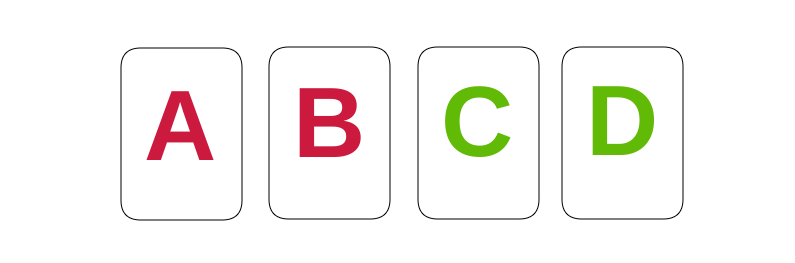

# The Iowa Gambling Task

The [Iowa Gambling Task](https://en.wikipedia.org/wiki/Iowa_gambling_task) is a psychological task thought to simulate real-life decision making. There are 4 decks for participants to choose from. Each time they choose a deck they get either a reward, a penalty or a mixture of both. The aim is to get the most money. Two of the decks contain more penalties and two contain more rewards. It was found that most people tended to stick to the "good" decks after roughly 50 selections.

Decks A and B are known as the "good" decks because they have a positive net outcome whereas decks C and D have a negative net outcome. There are slight differences in these outcomes in each study. There are three different payloads:

1. In Fridberg, Maia, and Worthy, deck C has a variable loss of either −25, −50, or −75. 
2. In Horstmann, Streingroever, and Wetzels, they maintain the loss of deck C as a constant of -50.
3. In Kjome, Premkumar, and Wood, the schedules of rewards and losses in such a way that the net outcome of the "bad" decks decreases by 150 every 10 cards and the net outcome of the "good" decks increases by 25 every 10 cards.

My objective was to clean and process the [data](https://osf.io/8t7rm/) and perform clustering analysis on it to gain insights into the Iowa Gambling Task and real-life decision making. Another target was to find a way to perform clustering on the data while preserving the privacy of each individual lab.

